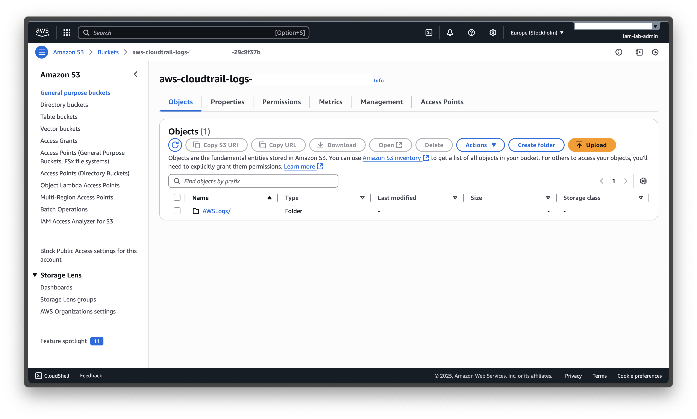

# 🔐 AWS IAM Hardening Lab Report

## 📖 Introduction
This report documents the implementation of IAM hardening measures in AWS.  
The goal of this lab was to design, implement, and validate security controls following best practices:
- Just-in-Time (JIT) administration with MFA
- Principle of Least Privilege (PoLP)
- Attribute-Based Access Control (ABAC)
- S3 bucket hardening (block public access, HTTPS-only, region restriction)
- Monitoring with CloudTrail and EventBridge
- Real-time alerting with SNS
- Incident response drill

---

## 🎯 Objectives
- Apply PoLP with IAM groups and policies
- Demonstrate ABAC scalability with tags
- Enforce MFA for all identities
- Secure S3 buckets against misconfiguration
- Enable CloudTrail for auditing
- Configure EventBridge + SNS for alerts
- Run a simulated incident drill

---

## 🧑‍🤝‍🧑 IAM Design
### Users and Groups
- Users: `iam-lab-admin` (LabAdmins), `dev-alice` (Analytics), `dev-robert` (Developers)
- Groups: `Analytics`, `Developers`, `LabAdmins`
- Role: `AdminJIT` with MFA enforced
- MFA enabled for all users ✅

**Proof:**  

---

## 🛡️ IAM Policies (PoLP & ABAC)
### PoLP (Static)
- Inline policies per group restricting access to team bucket only

### ABAC (Dynamic)
- Policies enforce access based on `team` tags
- Example: `aws:PrincipalTag/team` must match `aws:ResourceTag/team`

**Proof:**  
  
  

**Analysis:**  
PoLP works but requires separate policies.  
ABAC scales better by using tags across resources.

---

## 📦 S3 Hardening
### Buckets
- `analytics-team-data-721094929409` (Ireland - eu-west-1)
- `payments-team-data-721094929409` (Stockholm - eu-north-1)
- CloudTrail logs bucket

### Controls applied
- Block Public Access ✅
- Deny non-HTTPS ✅
- Deny cross-region requests ✅

**Proof:**  
  
  

---

## 📜 CloudTrail
- Multi-region trail created
- Management events + S3 Data events enabled
- Logs stored in dedicated CloudTrail bucket

**Proof:**  
  
  

---

## 📡 Monitoring & Alerting
### EventBridge
- Rules capturing `AccessDenied` events
- Separate rules for Analytics & Payments

### SNS
- Topics: `S3AccessDeniedAlertsAnalytics`, `S3AccessDeniedAlerts`
- Email subscription confirmed

**Proof:**  
  
  

---

## 📧 Alerts Received
- Example: `dev-robert` denied on Analytics
- Example: `dev-alice` denied on Payments
- Example: access denied on CloudTrail logs bucket

**Proof:**  
  
  

---

## 🚨 Incident Response Drill
Scenario: Exposed access key  
Process:
1. Revoke/rotate the key
2. Check CloudTrail for actions taken
3. Document incident

**Proof (theoretical):** see `/reports/incident-drill.md`

---

## ✅ Conclusion
This lab demonstrated:
- Strict IAM control with PoLP & ABAC
- Secure S3 configuration
- Full audit with CloudTrail
- Real-time alerts with EventBridge + SNS
- Awareness of incident response procedures

**Next steps / Improvements:**
- Automate response (Lambda for key revocation)
- Integrate alerts into SIEM
- Refine alert severity (critical vs low)

---
