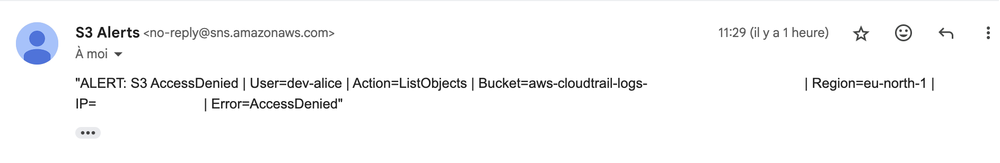
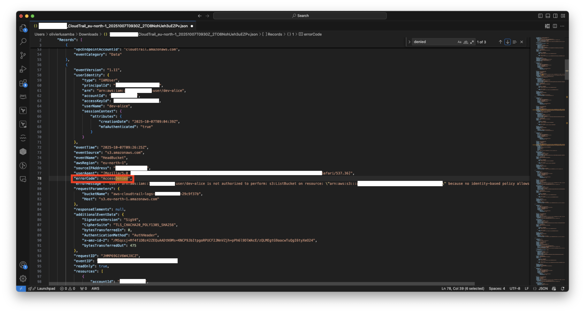
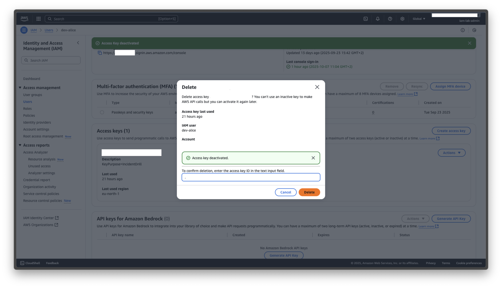

# Incident Drill – Compromised IAM Access Key Investigation

## 1. Objective
This exercise simulates the compromise of an IAM user's access key to validate the effectiveness of AWS monitoring and alerting mechanisms.  
It also assesses the ability to detect, investigate, and remediate a potential security incident using AWS native services.

---

## 2. Initial Detection
**Trigger:** An alert email was received from Amazon SNS, triggered by an EventBridge rule detecting an `AccessDenied` event on Amazon S3.  
**Affected entity:** IAM user `dev_alice`.  
**Purpose:** To confirm that the EventBridge rule correctly notifies when an IAM user attempts to access restricted S3 resources.

**SNS Alert Content:**
`"ALERT: S3 AccessDenied | User=dev-alice | Action=ListObjects | Bucket=aws-cloudtrail-logs-<redacted> | Region=eu-north-1 | IP=<redacted> | Error=AccessDenied"`

**Key Indicators:**
- Event source: `s3.amazonaws.com`  
- Event name: `ListObjects`  
- IAM user: `dev_alice`  
- Region: `eu-north-1`  
- Error: `AccessDenied`  

**Detection Pipeline:**  
CloudTrail (data events) → EventBridge rule (`detail.errorCode = AccessDenied`) → Input Transformer → SNS → Email notification  

**Evidence:**  

---

## 3. Investigation
To verify and analyze the alert, the CloudTrail Event History was used.

**Steps:**
1. Open CloudTrail Event History.  
2. Filter by `EventName: ListObjects` and `Username: dev_alice`.  
3. Identify the Access Key ID used in the event.  
4. Verify the timestamp and source IP address.  

**Findings:**
- The request originated from an unfamiliar IP address.  
- The Access Key matched the one intentionally exposed for this controlled drill.  
- CloudTrail confirmed the validity of the alert triggered via EventBridge and SNS.  

**Evidence:**  

---

## 4. Containment and Mitigation
Once the compromised access key was confirmed, immediate remediation steps were taken.

**Actions:**
1. Logged into the AWS IAM console as an administrator.  
2. Navigated to the IAM user `dev_alice`.  
3. Deactivated and deleted the compromised access key.  

**Result:**  
Subsequent access attempts using the compromised key failed. The user account remained functional and protected by MFA.

**Evidence:**  

---

## 5. Root Cause Analysis
The drill was a controlled simulation involving the intentional exposure of an access key.  
It confirmed that the detection pipeline is capable of flagging unauthorized activity.  

In real-world scenarios, similar incidents may occur due to:
- Accidental publication of credentials in code repositories.  
- Local environment compromise.  
- Reuse or sharing of access keys.  

**Underlying risk:** Long-lived IAM access keys represent a persistent security risk.

---

## 6. Lessons Learned and Recommendations

| Category | Recommendation |
|-----------|----------------|
| Access Control | Replace long-lived keys with temporary credentials (STS). |
| Monitoring | Expand EventBridge rules to include `CreateAccessKey`, `UpdateAccessKey`, and `DeleteAccessKey` events. |
| Alerting | Route all sensitive API calls and `AccessDenied` events to an SNS topic for security notifications. |
| Logging | Keep CloudTrail enabled in all regions and validate log integrity. |
| Key Rotation | Enforce a 90-day rotation policy for IAM access keys. |
| Awareness | Train developers on secure key handling and incident response. |
| Incident Response | Maintain and test an Incident Response (IR) playbook for key compromise scenarios. |

---

## 7. Outcome
The incident simulation confirmed that:
- The detection and alerting pipeline (CloudTrail → EventBridge → SNS → Email) is operational.  
- The response workflow effectively mitigates compromised access key scenarios.  
- The team can detect and respond promptly to unauthorized S3 access attempts.  

This drill serves as both a validation of AWS security monitoring and a training reference for incident response best practices.

---

## 8. Evidence Summary

| Screenshot | Description |
|-------------|-------------|
| `IncidentDrill-Alert-Email.png` | SNS alert email confirming detection pipeline functionality. |
| `IncidentDrill-CloudTrail-AccessKeyEvent.png` | CloudTrail record confirming unauthorized access. |
| `IncidentDrill-AccessKey-Revoked.png` | Confirmation of successful key deactivation and deletion. |

---

**Date of drill:** October 2025  
**Simulated by:** Olivier Lusamba  
**AWS Account:** Redacted for security reasons  
**Test user:** `dev_alice`
